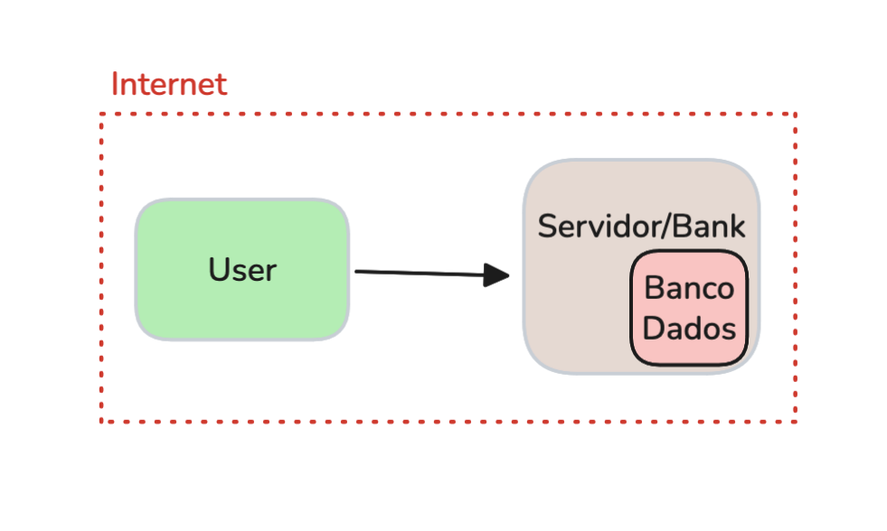
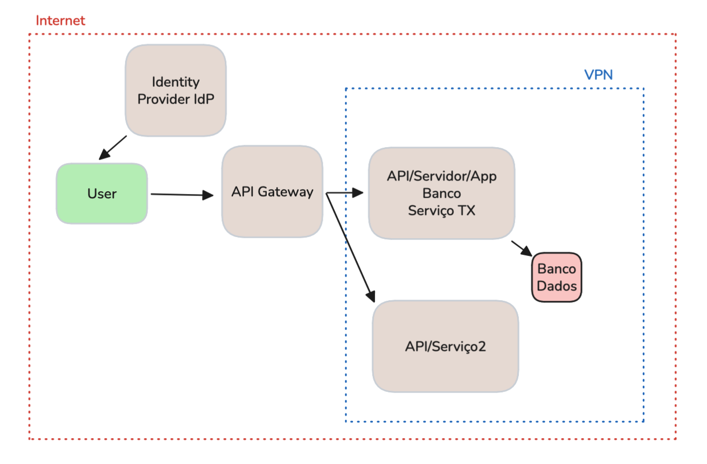
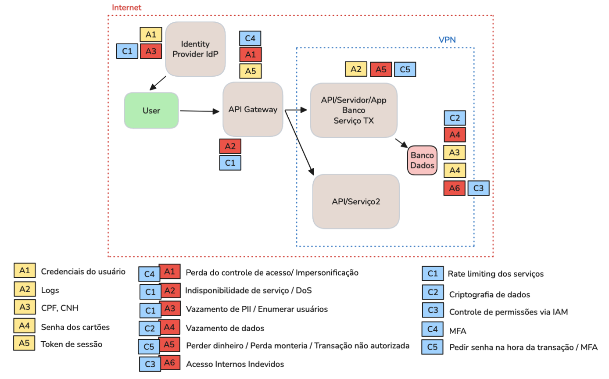

Nos últimos dias, tivemos mais uma atividade intensa e colaborativa dentro da Sunsec, comunidade que tenho muito orgulho de participar. É impressionante ver como os membros estão cada vez mais ativos, trocando experiências e crescendo juntos — tanto profissionais já da área quanto estudantes que estão se desenvolvendo.

Inspirado por uma mentoria que tive recentemente com o Jodson Santos , decidi compartilhar um pouco com os membros da Sunsec sobre arquitetura de aplicações e modelagem de ameaças em um cenário muito comum: empresas financeiras em estágio inicial, ainda operando com um MVP(minimum viable product).

Os membros da Sunsec que participaram desta atividade foram Édson, Ellen, Rio, Cirilo, Jonathas e José Eduardo.

# O Cenário Inicial

Começamos simples: uma aplicação web hospedada em um único servidor, junto com o banco de dados. Essa é a realidade de muitos MVPs — foco em colocar o produto no ar rápido, mas ainda com pouca preocupação em arquitetura no geral. Pode parecer brincadeira, mas tem muita empresa que começa assim, mesmo sendo algo tão sensível quanto a área financeira.

# Evoluindo a Arquitetura

Durante a própria modelagem de ameaças, fomos aumentando gradualmente a arquitetura, simulando como uma empresa financeira evoluiria ao longo do tempo. Mas em vez de apenas reproduzir o crescimento natural, decidimos antecipar cenários que poderiam ser muito ruins se não fossem tratados desde cedo.

Assim, passamos do MVP inicial (app + banco no mesmo servidor) para versões mais robustas, adicionando:

- Identity Provider para autenticação centralizada.
- API Gateway como ponto de entrada e camada de controle.
- Dois microserviços separados, cada um com responsabilidades claras.
- Banco de dados isolado.
- Boundary interno via VPN, restringindo acessos críticos.

Esse tipo de exercício não é o que normalmente acontece em times de produto, onde a prioridade é entregar rápido e validar o negócio — e isso não é um problema, faz parte do ciclo natural de inovação. Mas foi enriquecedor perceber que os membros da Sunsec já conseguem exercitar uma visão de segurança desde o início do processo, trazendo maturidade adicional ao raciocínio arquitetural.

## Pensando Como Atacante

O exercício ficou mais interessante quando nos colocamos no papel do agente malicioso. A partir da arquitetura, fomos listando:

- Que superfícies de ataque existiam?
- Onde poderíamos explorar falhas de autenticação?
- Como abusar de limites mal configurados?
- Que impactos teriam vazamentos de dados ou acessos indevidos?

## Decisões de Segurança Que Mudam o Jogo

Chegamos a conclusões valiosas: algumas poucas decisões de arquitetura de segurança, se aplicadas cedo, poderiam ajudar enormemente não só no monitoramento de fraudes, mas também na resiliência da aplicação.

Exemplos de controles que apareceram naturalmente durante a atividade:

- Rate limit para serviços expostos.
- Criptografia de dados sensíveis em trânsito e em repouso.
- MFA (autenticação multifator) para reduzir riscos de fraudes em contas.

No fim, esse não foi apenas um exercício sobre arquitetura ou modelagem de ameaças. Foi um momento de aprendizado coletivo dentro da Sunsec. A própria dinâmica de pensar em conjunto, questionar, imaginar ataques e propor controles já ajuda a elevar a maturidade de todos os envolvidos.

Esses encontros mostram que não precisamos de grandes cenários para aprender: basta um MVP e a disposição de pensar como atacante e como defensor.
Conclusão

Sair de um MVP desprotegido para uma arquitetura segura é um caminho de aprendizado incrível. E foi exatamente isso que vivemos nesse estudo.

A Sunsec continua mostrando que, quando estudamos juntos, crescemos mais rápido. E essa é só mais uma das muitas atividades que nos ajudam a evoluir como profissionais e como comunidade.

Deixo o link aqui de alguns outros trabalhos da Sunsec e também de um artigo onde eu explico mais sobre modelagem de ameaças da forma que executamos nesta atividade.

modelagem de ameaças: https://guisso.dev/posts/threat-modeling-intro/

